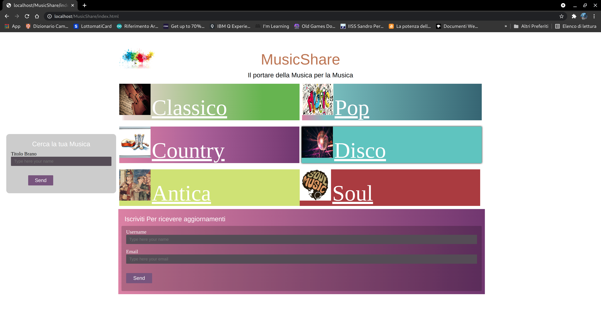
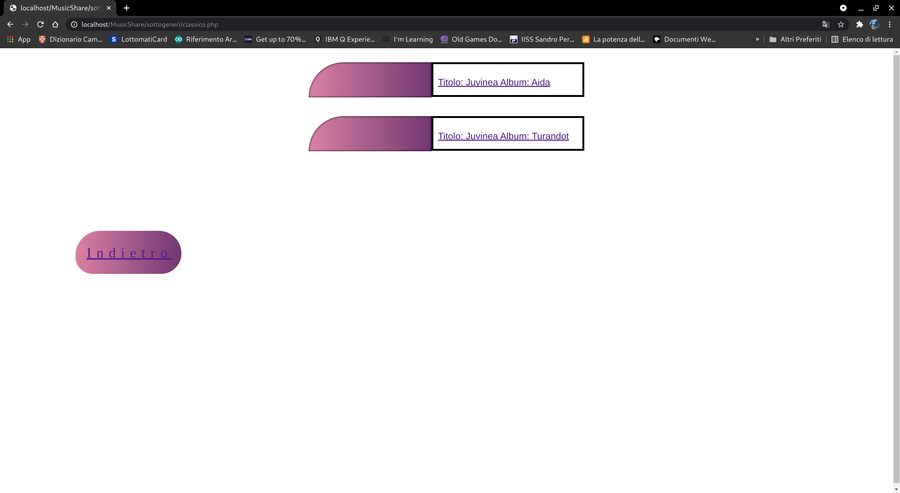
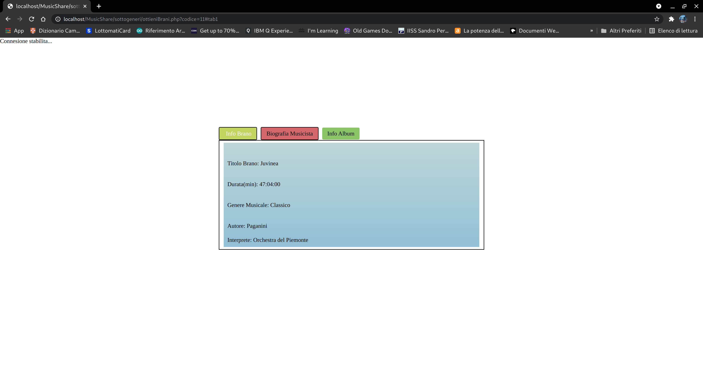
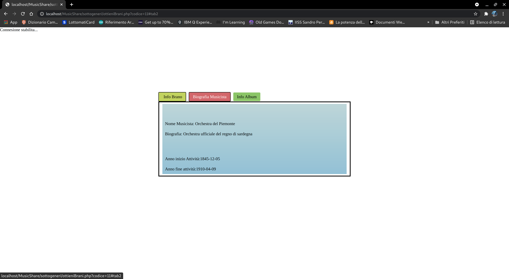
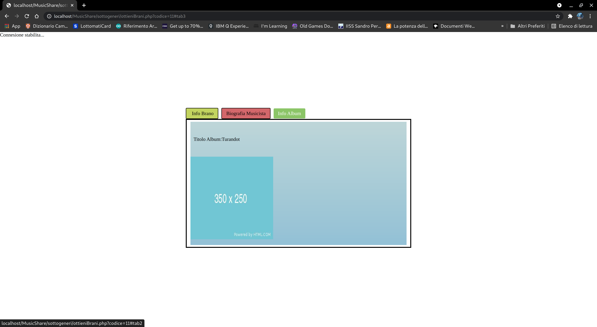
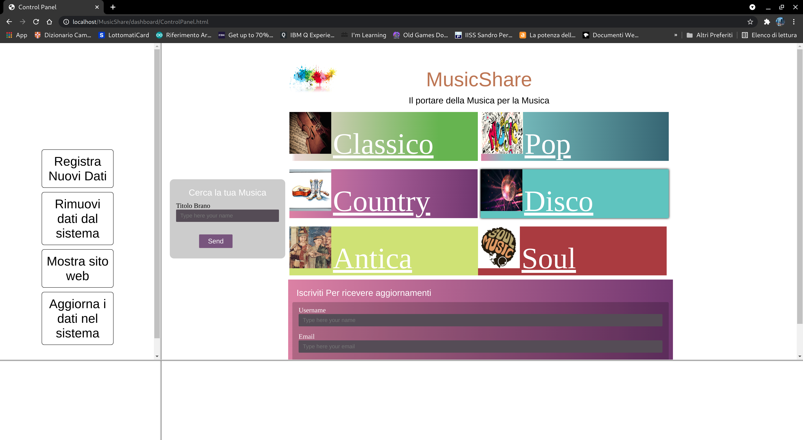
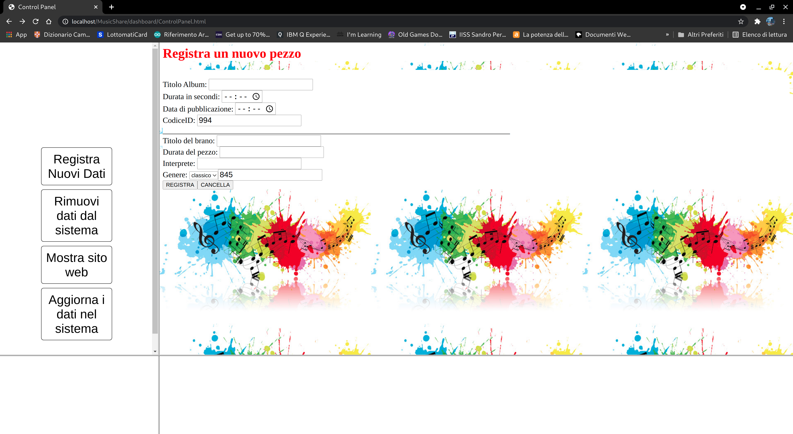
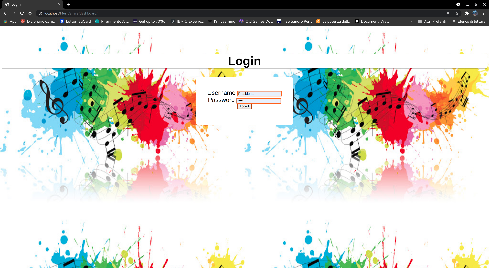

# MusicShare: Il portale per gli amanti della musica 🔊
_____________________________________________________

"Il nuovo portale per gli appassionati della musica aperto a tutti,
scopri nuovi musicisti ed i loro album, ricerca la musica che vuoi
oppure informati sulle ultime tendenze musicali "

***Registrati Adesso***

 [Registrati adesso per ricevere le ultime new del mondo musicale!](http://localhost/MusicShare/registrazione/registra.html)

***Se vuoi essere solo un visitatore vieni a scoprire MusicShare***

 [Vai al sito](http://localhost/MusicShare/index.html)

|Indice del sito|
|---------------|
La piattaforma web della casa discografica è articolata in due parti distinte:
* Parte **amministrativa** costituta da una dashboard che permette l'inserimento di nuovi brani alla raccolta digitale. Tale area per motivi di sicurezza sarà accessibile solamente da un numero ristretto di persone autorizzate per mezzo di un login effetuabile inserendo username e password valide.  
* Parte **Sito Web** rivolta ai visitatori del sito che potranno ricercare le informazioni dei propri brani preferiti per mezzo delle modalità di ricerca messe a disposizione della piattaforma (per brano o per genere), inoltre sempre tramite la medesima sezioni ivisitatori si potranno iscrivere alla newsettler per ricevere aggiornamenti costanti sulle ultime produzione dell'etichetta musicale
* Le due parti della piattaforma saranno rangiungibili tramite due indirizizzi web distinti per mezzo di un qualsiasi web browser.

# Front End per gli Utenti: Sito Web
|Index|
|-----------------------------|
Gli utenti che si collegheranno al sito www.MusicShare.it vedranno come prima cosa la segente pagina web:  Gli utenti potranno ricercare il brano musicale desiderato interagendo con la scheda centrale tramite i link che suddividono i brani presenti sulla piattaforma in base al genere oppure ricercare con il form a sinistra della scheda centrale un dato brano in base al titolo  **Codice** <li>[index.html](index.html) <li>[style.css](./css/style.css)

|Brani suddivisi in base al genere|
|---------------------------------|
  **Codice** <li>[antica.php](sottogeneri/antica.php) <li>[style.css](sottogeneri/style.css)

|Scheda informativa dei brani|
|----------------------------|
Indipendentemente dalla modalità di ricerca dei brani le informazioni trovate veranno organizzate in una scheda informativa organizzata in tre sezioni distinte: la prima riguardante il brano, la seconda l'interprete e l'ultima  l'album di appartenenza del brano.  **Codice**<li>[research.php](research.php) (via form)  <li>[ottieniBrani.php](sottogeneri/ottieniBrani.php) (via link)

|**Sezione informativa del brano**|
|---------------------------------|

|**Sezione Informativa del Musicista**|
|-------------------------------------|

|**Sezione Informativa Album**|
|-----------------------------|

# Front End per l'amministratore: La dashboard

|index|
|-----|
Gli amministratori della piattaforma avranno a disposizione una dashboard per gestire l'inserimento, la modifica e l'eleminazione dei dati innerenti ai brani musicali, sempre attraverso la dashboard gli amministratori potranno monitorare il sito web.    **Codice**<li>[ControlPanel.html](dashboard/ControlPanel.html)   <li>[left.html](dashboard/left.html) <li>[right.html](dashboard/right.html)

|Registra Nuovi Brani|
|--------------------|
La sezione della dashboard Registra Nuovi Dati permette di inserire nuove informazioni di brani registrato dall'etichetta musicale per mezzo di un apposito modulo   ** *Le restanti senzioni seguono la medesima procedura*  **Codice**<li>[aggiungi.php](dashboard/insert/index.php)

|Login|
|-----|
L'accesso al panello di controllo (o dashboard) sarà limitato da un login che richiede come dati d'accesso "username" e "password" (gli account saranno già memorizzati nel sistema al momento del login):
  **Codice**<li>[index.html](dashboard/index.html)  

 |Riferimenti a risorse esterne|
 |-----------------------------|
 
 Sito realizzato con GrapesJS, il Web Builder Framework gratuito e open source  di nuova generazione per la creazione di modelli senza codifica.
 **Scopri di piu' sul sito del progetto:** https://grapesjs.com/ :link:
