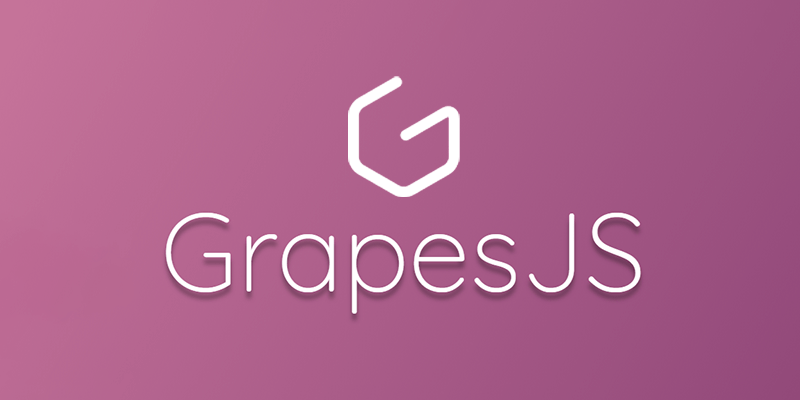

# MusicShare: Il portale per gli amanti della musica 🔊
_____________________________________________________

"Il nuovo portale per gli appassionati della musica aperto a tutti,
scopri nuovi musicisti ed i loro album, ricerca la musica che vuoi
oppure informati sulle ultime tendenze musicali "

***Registrati Adesso***

 [Registrati adesso per ricevere le ultime new del mondo musicale!](http://localhost/MusicShare/registrazione/registra.html)

***Se vuoi essere solo un visitatore vieni a scoprire MusicShare***

 [Vai al sito](http://localhost/MusicShare/index.html)

|Indice del sito|
|---------------|
La piattaforma web della casa discografica è articolata in due parti distinte:
* Parte **amministrativa** costituta da una dashboard che permette l'inserimento di nuovi brani alla raccolta digitale. Tale area per motivi di sicurezza sarà accessibile solamente da un numero ristretto di persone autorizzate per mezzo di un login effetuabile inserendo username e password valide.  
* Parte **Sito Web** rivolta ai visitatori del sito che potranno ricercare le informazioni dei propri brani preferiti per mezzo delle modalità di ricerca messe a disposizione della piattaforma (per brano o per genere), inoltre sempre tramite la medesima sezioni ivisitatori si potranno iscrivere alla newsettler per ricevere aggiornamenti costanti sulle ultime produzione dell'etichetta musicale
* Le due parti della piattaforma saranno rangiungibili tramite due indirizizzi web distinti per mezzo di un qualsiasi web browser.   

 |Riferimenti a risorse esterne|
 |-----------------------------|
 
 Sito realizzato con GrapesJS, il Web Builder Framework gratuito e open source  di nuova generazione per la creazione di modelli senza codifica.
 **Scopri di piu' sul sito del progetto:** https://grapesjs.com/ :link:
